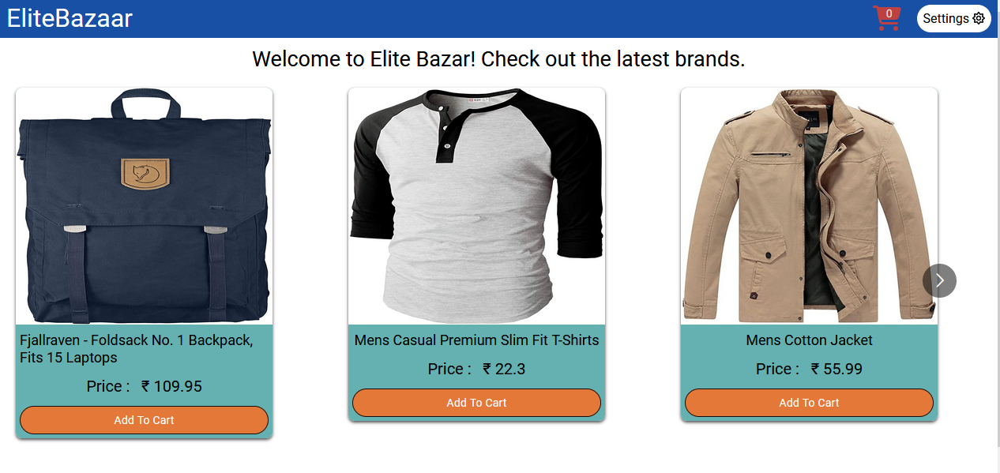

# Elite Bazaar 🛍

Welcome to Elite Bazaar – your ultimate destination for online shopping! Experience seamless browsing, intuitive cart management, and customizable viewing options in our React.js-powered eCommerce app. Utilizing the power of hooks and context, we ensure a seamless shopping experience from start to finish. Happy shopping with Elite Bazaar! 🎉 

### 🌐 Hosted Link : [Link](https://pine-elite-bazaar.netlify.app/)

### 🎞 Vedio Link : [Link](https://drive.google.com/file/d/1OBokGVffHbJALpYecZPk65Gy7fLPoTBJ/view)

### 🖼 Image :

## 🔥 Key Features:

- <b>Add to Cart & Remove:</b> Users can easily add products to their cart with a single click and remove them if needed.
- <b>Cart Preview:</b> Simply click on the cart icon to get a quick preview of the items added along with the total price.
- <b>View Options:</b> Enjoy the flexibility to switch between carousel and list view for product browsing.
- <b>Customizable Settings:</b> Personalize your experience by adjusting settings for the navbar, item list view, and product card view.
- <b>Fully Responsive:</b> Whether you're browsing on a desktop, tablet, or mobile device, our app adapts to provide an optimal viewing experience.

##  🚀 Technologies Used:

- React.js
- HTML5 & CSS3
- JavaScript

## 🛠 Tools Used:

- axios
- react-icons
- react-multi-carousel
- react-router-dom

## 💻 How to setup the project on local system
- Clone this project to your local system.
- Run `npm i` to install required dependencies.
- Run `npm run dev` to start the app.
- The app will be live on [http://localhost:8000](http://localhost:8000).

